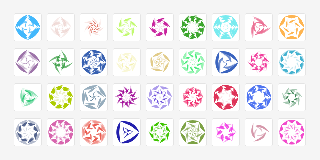

# Solacon


This package is a .NET implementation of the *Solacon* algorithm. A *solacon* is a variation of an [identicon](https://en.wikipedia.org/wiki/Identicon), a visual hash in the form of a solar/spiral/floral shape.

The solacon is seeded with a value (string) which determines the shape, symmetry, and shades of the image.



This implementation generates significantly (10-20%) smaller SVG files that are visually identical to the original Solacon algorithm.

## Usage

```csharp
using Solacon;

// The generator returns a static SVG string with no embedded JavaScript or client-side rendering dependency.

// Generate a deterministic solacon
var svg = SolaconGenerator.GenerateSvg(
    seed: "Hello world.");

// Include custom colors or titles
var svg = SolaconGenerator.GenerateSvg(
    seed: "Hello world.",
    rgb: "0, 30, 255",
    includeTitle: true,
    title: "My Solacon");

// Omit titles for smaller filesize
var svg = SolaconGenerator.GenerateSvg(
    seed: "Hello world.",
    includeTitle: false);
```

## Acknowledgments

This package is based on the [Solacon project by Jon Van Oast](https://github.com/naknomum/solacon).
- See [LICENSE-3RD-PARTY.md](LICENSE-3RD-PARTY.md) for the third-party notice and original MIT license text.

